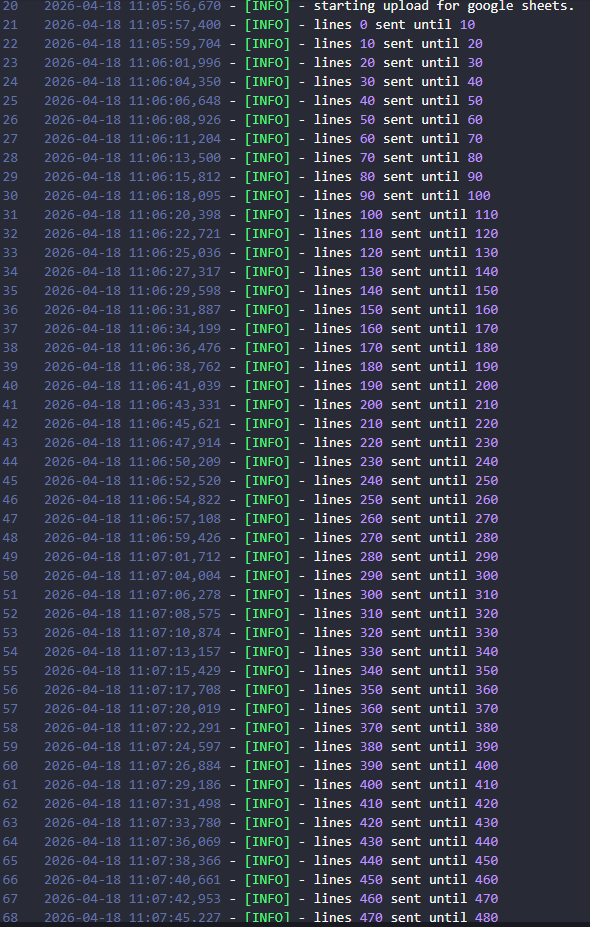
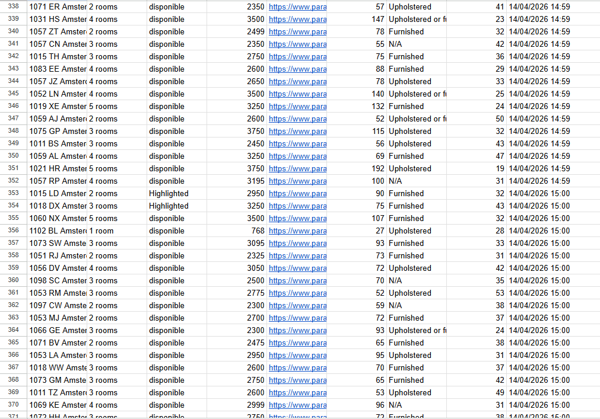
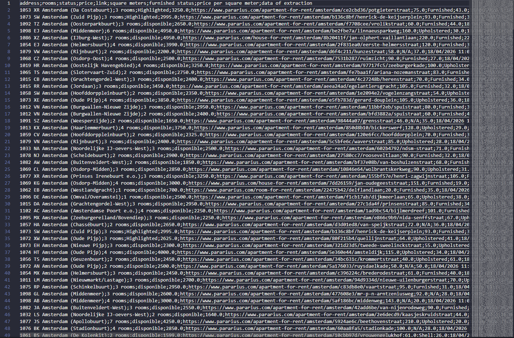
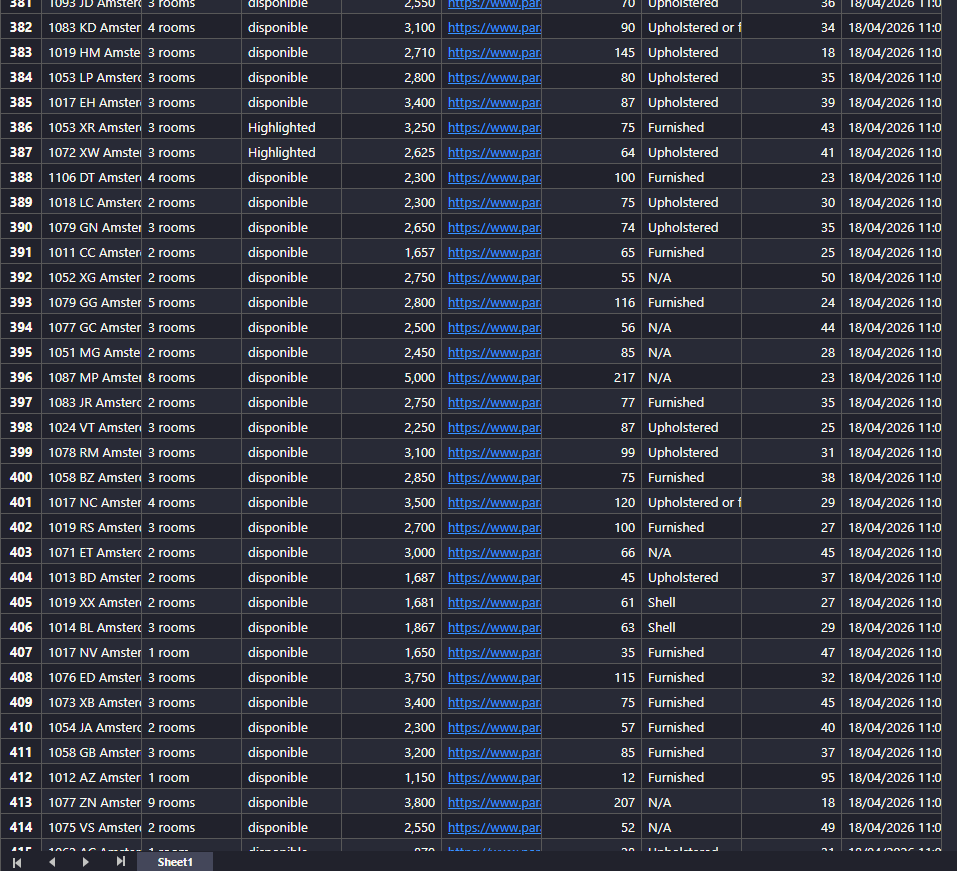

# 🏢 Apartments Web Scraper | Pythonic Effort

A robust and **faster** web scraping tool built with **Python**, **Selenium**, and **BeautifulSoup**. The script extracts data from www.pararius.com and persists the collected data in multiple professional formats.

## 🛠️ Features

* **Automated Data Extraction**: Extracts the address, number of rooms, status, price, link, square meters, furnished status, price per square meter, and the extraction date/time.
* **Data Cleaning**: The script processes and cleans the data (e.g., converting "€2.500,00" to "2500") for immediate analysis.
* **Anti-Bot Bypass**: Integrated with `undetected-chromedriver` to avoid anti-bot blocks on pararius.com.
* **Error Handling**: Uses `try` and `except` blocks to ensure the script is robust and functions correctly even during internet oscillations.
* **Logging System**: Integrated with the `logging` library to register the script's activity.
* **Human-like Behavior**: Uses randomized delays (jitters) and optimized navigation to simulate human behavior.
* **Multi-format Persistence**:
    * **Local**: Data persistence in CSV (UTF-8-SIG encoded) and XLSX.
    * **Cloud**: Real-time data persistence in Google Sheets, updating information in batches to avoid API rate limits.

## 🛠️ Choice of tools: why Selenium and BeautifulSoup?

I used these tools because pararius.com is a dynamic site, so I needed:
* **Selenium**: To access the site and simulate human behavior to avoid anti-bot detection.
* **BeautifulSoup**: To process the information from the site faster.

## 📊 Results and performance

### Execution logs

### Data Output (Google Sheets, CSV, and XLSX)

## 📋 Setup and prerequisites

**Google Sheets integration**: For the script to store data correctly, follow these steps:
* **Open file**: Open a new spreadsheet in Google Sheets and rename it to "Planner properties".
* **Share access**: Copy your `client_email` address from `creds.json` and share the spreadsheet with it.

**Rename**:
Rename `creds_example.json` to `creds.json`.
*Note: You need to create a Service Account in your Google Cloud Console and download the JSON key to create the `creds.json` file.*

**Installation**:
Install the libraries listed in `requirements.txt` via your terminal:
`pip install -r requirements.txt`

## ⚙️ Exceptional structure of the script:

* **Security and credibility**: Sensitive data is protected by `.gitignore`.
* **Code structure and documentation**: Clean code structure using OOP and professional documentation.
* **Global engineering**: Uses international software engineering standards.

Another step towards daily evolution! ⭐ 
*Pythonic Effort*
